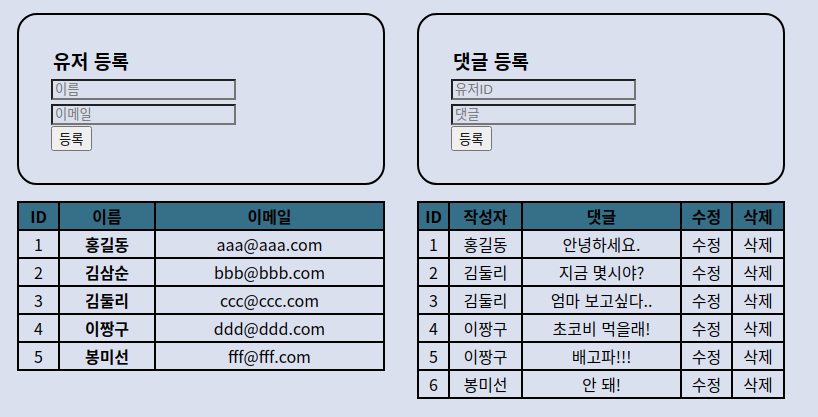

## 🔎 기능

- User Form 제출 시 UsersTable 레코드 추가
- Comment Form 제출 시 CommentsTable 레코드 추가
- 이름 클릭 시 필터링

## 🔬 TECH

- JavaScript
- Sequelize(ORM)
- Express

## 📋 API 문서

| Method               | Description              |
| -------------------- | ------------------------ |
| GET /users           | 유저 목록 조회           |
| POST /users          | 유저 생성                |
| GET /users/:id       | 특정 유저 댓글 목록 조회 |
| GET /comments        | 댓글 목록 조회           |
| POST /comments       | 특정 유저 댓글 작성      |
| PATCH /comments/:id  | 특정 유저 댓글 수정      |
| DELETE /comments/:id | 특정 유저 댓글 삭제      |
